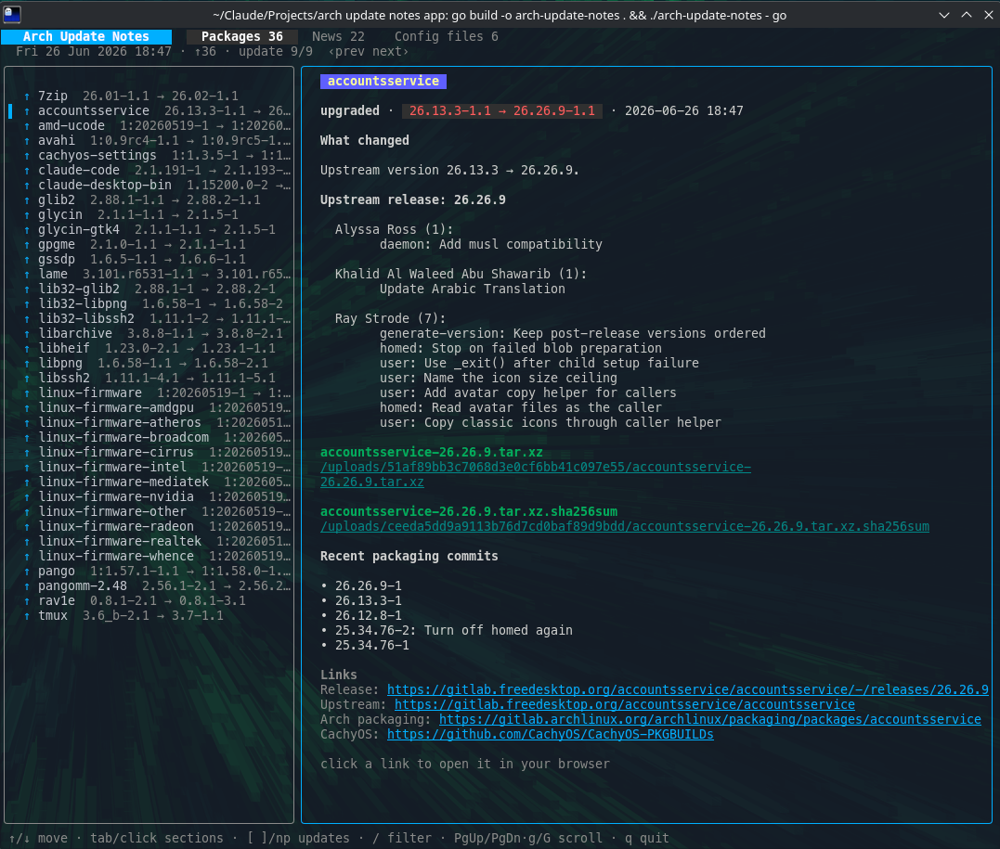

# arch-update-notes

A terminal UI that gathers the notes for your most recent system update on
Arch-based distros (CachyOS, Arch, EndeavourOS, …). Run it after a
`cachy-update` / `pacman -Syu` to see what changed and what needs attention.



It pulls together, for the last update session:

- **Packages** — everything upgraded/installed/removed, parsed from
  `/var/log/pacman.log`, with old → new versions.
- **What changed** — since most packages ship no changelog, it falls back to the
  version delta (flagging pure rebuilds like `1.6.58-1.1 → 1.6.58-2.1`), upstream
  release notes from GitHub/GitLab, and the packaging source (Arch GitLab / AUR)
  with its recent commits. Local `pacman -Qc` changelogs are shown when present.
- **News** — recent Arch and CachyOS announcements, `[NEW]`-tagged around the
  update date — where manual-intervention warnings live.
- **Config files** — pending `.pacnew` / `.pacsave` files (via `pacdiff -o`).
- **Snapshots** — if you use snapper + snap-pac on btrfs, the pre/post snapshot
  for each transaction, with the rollback/undo commands. Sessions that have a
  snapshot are flagged with `❄` in the Packages view.

Detail panes render as Markdown, URLs are clickable (open in your browser), and
it's fully mouse-aware. The app is read-only — it never touches your system
(snapshot rollback commands are shown for you to run, never executed).

Snapshots are root-only on a default snapper setup, so run `sudo arch-update-notes`
to see them, or let your user read the `root` config:

```sh
sudo snapper -c root set-config ALLOW_GROUPS=wheel SYNC_ACL=yes
```

Built with [Bubble Tea](https://github.com/charmbracelet/bubbletea),
[Glamour](https://github.com/charmbracelet/glamour),
[bubblezone](https://github.com/lrstanley/bubblezone), and
[Harmonica](https://github.com/charmbracelet/harmonica).

## Install

Prebuilt Linux binaries (amd64 / arm64) are on the
[Releases](https://github.com/captainmustard/arch-update-notes/releases) page:

```sh
curl -LO https://github.com/captainmustard/arch-update-notes/releases/latest/download/arch-update-notes-v0.2.1-linux-amd64
chmod +x arch-update-notes-v0.2.1-linux-amd64
sudo install arch-update-notes-v0.2.1-linux-amd64 /usr/local/bin/arch-update-notes
```

Or build from source (Go 1.24+; `pacman-contrib` enables `.pacnew` detection):

```sh
go install github.com/captainmustard/arch-update-notes@latest
```

## Usage

```
arch-update-notes [--log <path>] [--no-news] [--version]
```

Transactions within 15 minutes are grouped into one "update session"; it opens
on the latest and `[` / `]` browse earlier ones. `--no-news` runs fully offline.

## Keys

| Key | Action |
| --- | --- |
| `↑`/`↓` `j`/`k` | Move selection |
| `tab` / `1`–`4` | Switch section (Packages / News / Config files / Snapshots) |
| `[` / `]` | Previous / next update session |
| `/` | Filter |
| `PgUp`/`PgDn` `u`/`d` `g`/`G` | Scroll detail |
| mouse | Click tabs, rows, links, `‹prev`/`next›`; wheel scrolls |
| `q` | Quit |

## License

MIT
